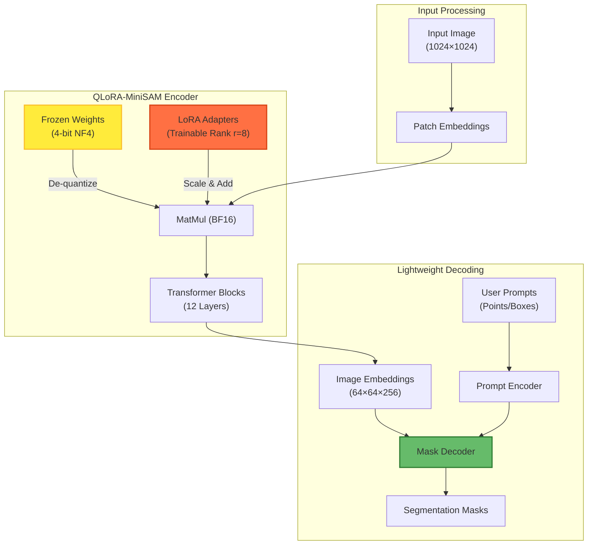
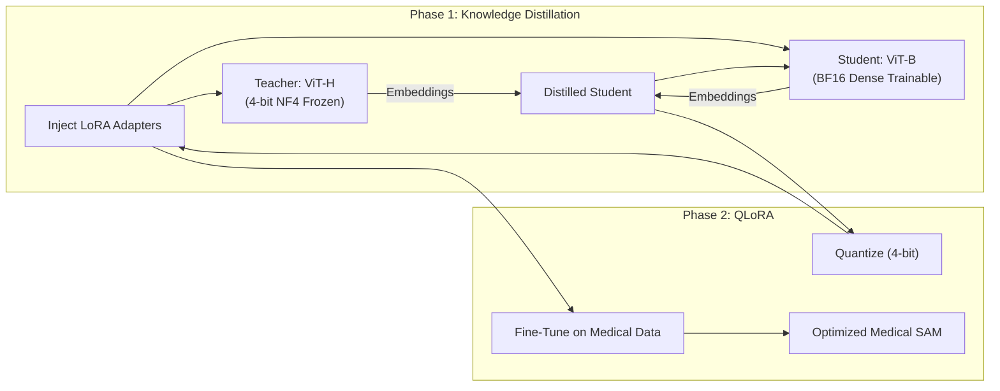

### QLoRA-MiniSAM: A Quantized LoRA-Adapted Lightweight SAM for Medical Image Segmentation

## Objective
Develop **QLoRA-MiniSAM**, a **lightweight, 4-bit quantized**, and **LoRA-adapted** version of the Segment Anything Model (SAM)  tailored for medical image segmentation (MIS) by combining knowledge distillation from the original SAM with **ViT-H** into a compact **ViT-B encoder** and Low-Rank Adaptation (LoRA) for modality-specific fine-tuning, achieving near-SOTA zero-shot and few-shot segmentation performance (**≥90% of ViT-H’s Dice score**) on COSMOS-1050K while reducing:
- **Inference latency**: **~7×**
- **Memory footprint**: **>90%**
- **Training cost**: **>95%**

The system will enable **real-time, on-device MIS** and **plug-and-play modality adapters** (CT, MRI, US) with **<1GB VRAM**.

## Introduction
The Segment Anything Model (SAM) [Kirillov et al., 2023] represents a landmark in foundation models for vision, demonstrating unprecedented zero-shot generalization to arbitrary object segmentation via prompt-based interaction. Trained on over 11 million images and 1 billion masks, SAM leverages a Vision Transformer (ViT) backbone—particularly the high-capacity ViT-H/14 variant—to extract rich, hierarchical visual representations, enabling robust performance across diverse natural image domains. Recent large-scale evaluations on medical imaging [Huang et al., 2024], however, reveal significant limitations when applying SAM directly to medical image segmentation (MIS): while SAM exhibits promising results on well-defined anatomical structures, it struggles with amorphous lesions, fine boundaries, low-contrast regions, and modality shifts. Moreover, the computational demands of ViT-H (∼190 GFLOPs, 632M parameters) render it impractical for clinical deployment, especially on resource-constrained devices or in real-time workflows. 

Concurrently, knowledge distillation into lightweight architectures (e.g., MobileViT, TinyViT) has shown success in compressing SAM for edge deployment. Yet, no prior work has systematically combined distilled lightweight encoders with LoRA-based modality adaptation to create a unified, efficient, and generalizable framework for MIS.

To bridge this gap, **QLoRA-MiniSAM** combines:
1. **Knowledge distillation** from ViT-H → **ViT-B** (Mini-SAM)
2. **4-bit quantization** (NF4 + double quant) via **QLoRA**
3. **LoRA adapters** for **modality-specific fine-tuning**

This design yields a **deployable foundation model** for MIS i.e., it enables

- plug-and-play adapters per imaging modality, 

- supports few-shot learning with <100 labeled samples, 

- and achieves real-time inference (>30 FPS on consumer GPUs). 

Being Evaluated on the COSMOS-1050K benchmark [Huang et al., 2024], QLoRA-MiniSAM targets 4–6% Dice improvement over zero-shot SAM with <5M trainable parameters, <10 GFLOPs per forward pass, and >70% reduction in memory via 4-bit quantization, making it a practical, deployable foundation model for clinical MIS.

## Detailed Architecture & Implementation

### 1. Core Components

#### A. Models (`src/models/`)
*   **`StudentSAM` (`sam_vitb.py`)**: 
    *   Wraps the standard `facebook/sam-vit-base` model from Hugging Face.
    *   Initialized as a dense (FP32/BF16) model for Phase 1 distillation.
    *   All parameters are trainable during the distillation phase.
*   **`QLoRAMiniSAM` (`qlora_minisam.py`)**:
    *   Wraps the **distilled** student model for Phase 2.
    *   **Quantization**: Conditionally applies 4-bit NF4 quantization (via `BitsAndBytesConfig`) if CUDA is available. On CPU/MPS, it keeps the model in full precision (Float32/Float16).
    *   **LoRA Injection**: Injects Low-Rank Adapters (`LoraConfig`) into the Attention layers (`qkv`, `q_proj`, `v_proj`) of the Vision Transformer.
    *   **Freezing**: Freezes the base model weights, training *only* the LoRA adapters (reducing trainable parameters to <5%).

#### B. Training Workflow (`src/training/`)

**Phase 1: Knowledge Distillation (`trainer_distill.py`)**
1.  **Teacher Setup**: Loads `facebook/sam-vit-base` (or ViT-H) as the frozen teacher.
2.  **Student Setup**: Initializes `StudentSAM` (ViT-B).
3.  **Forward Pass**: Passes the same image to both Teacher and Student.
4.  **Loss Calculation** (`src/distillation/loss.py`):
    *   **Feature Loss**: MSE loss between the normalized image embeddings of Teacher and Student.
    *   **Mask Loss**: KL Divergence between the softened logits of the predicted masks.
    *   `Total Loss = alpha * FeatureLoss + (1-alpha) * MaskLoss`
5.  **Output**: Saves the distilled student weights using `save_pretrained`.

**Phase 2: QLoRA Fine-Tuning (`trainer_qlora.py`)**
1.  **Model Loading**: Loads the *distilled* student from Phase 1 into `QLoRAMiniSAM`.
2.  **Adaptation**: Applies 4-bit quantization (if GPU) and injects LoRA adapters.
3.  **Training**: Fine-tunes *only* the adapters on the specific medical modality (e.g., CT, MRI).
4.  **Loss Calculation**: Uses `MedSegLoss` (Combination of Binary Cross Entropy and Dice Loss) against the ground truth segmentation masks.

### 3. Configuration (`config/`)
The project uses **Hydra** for configuration management.
*   **`default.yaml`**: Sets global defaults (paths, wandb, etc.).
*   **`train/default.yaml`**: Defines default training hyperparameters (lr, batch_size, device).
*   **`train/distill.yaml`**: Overrides for distillation (e.g., higher epochs, specific loss weights).
*   **`train/qlora.yaml`**: Overrides for QLoRA (e.g., LoRA rank `r`, alpha).

You can override any parameter from the command line, e.g., `train.device=cuda`.

### 2. Architecture/Flow Diagram

# 3. Training Workflow:
